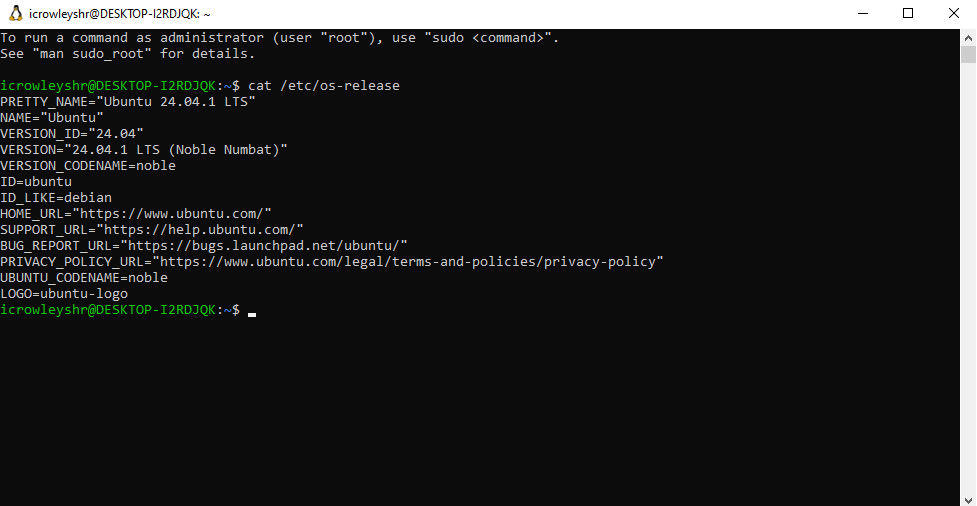
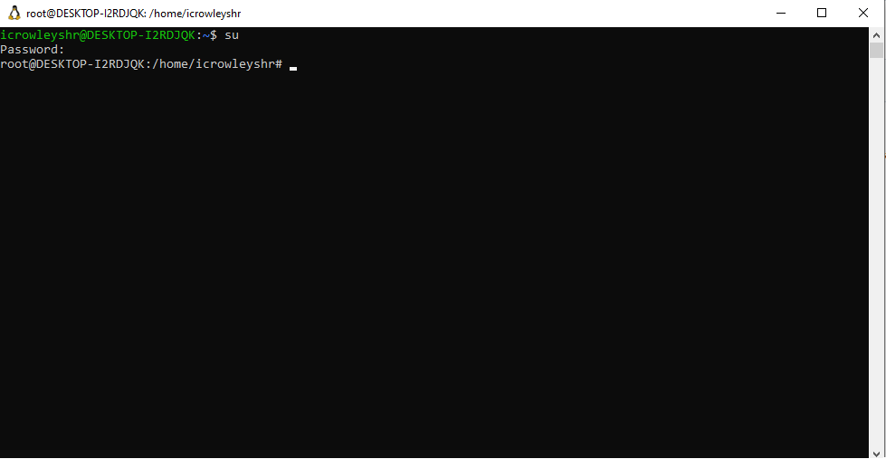

# infra-nginx-monitor

Este projeto tem como objetivo configurar uma infraestrutura Linux local capaz de hospedar um servidor web Nginx com uma página HTML simples, garantindo sua alta disponibilidade por meio de verificações automáticas e envio de alertas em caso de falhas.

Proposto pelo programa de bolsa **CompassUOL**.

---

## Distro

O projeto utiliza a WSL do Windows com a Distro Ubuntu.

<p align="center">
  
</p>

---

## Instalação e Configuração do Nginx

Toda a instalação e configuração será realizada com o usuário `root`.

Para acessar o usuário `root`, utilize o comando abaixo. Será solicitada a senha para execução:

### Sintaxe
```bash
su
```

Após a execução, o terminal ficará assim:

<p align="center"> 
 
</p>


